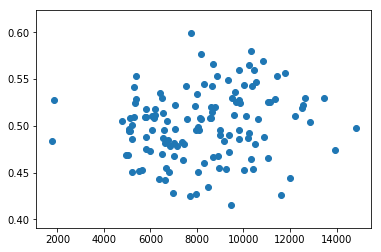

```python
# Every returned Out[] is displayed, not just the last one. 
from IPython.core.interactiveshell import InteractiveShell
InteractiveShell.ast_node_interactivity = "all"
```


```python
import nltk
import pandas as pd
import numpy as np
import matplotlib.pyplot as plt
```

This is the comment dataframe. It holds two years worth of comments from NLSS episodes. 


```python
comment_df = pd.read_pickle('Pipeline/comtok_df.pkl')

#comment_df['Tokens'] = comment_df['Comment'].apply(nltk.word_tokenize)

comment_df.head() 
comment_df.tail()
print(len(comment_df), 'comments')
```


<div>
<style>
    .dataframe thead tr:only-child th {
        text-align: right;
    }

    .dataframe thead th {
        text-align: left;
    }

    .dataframe tbody tr th {
        vertical-align: top;
    }
</style>
<table border="1" class="dataframe">
  <thead>
    <tr style="text-align: right;">
      <th></th>
      <th>Date</th>
      <th>User</th>
      <th>Comment</th>
      <th>Tokens</th>
    </tr>
  </thead>
  <tbody>
    <tr>
      <th>0</th>
      <td>August 24, 2017</td>
      <td>Moobot</td>
      <td>Thank you for subbing, IHaveNoPokeClue! :D :D</td>
      <td>[Thank, you, for, subbing, ,, IHaveNoPokeClue,...</td>
    </tr>
    <tr>
      <th>1</th>
      <td>August 24, 2017</td>
      <td>emperorvespasian</td>
      <td>VERY LARGE CONE</td>
      <td>[VERY, LARGE, CONE]</td>
    </tr>
    <tr>
      <th>2</th>
      <td>August 24, 2017</td>
      <td>KhanWight</td>
      <td>Kreygasm CLIMAX Kreygasm CLIMAX Kreygasm</td>
      <td>[Kreygasm, CLIMAX, Kreygasm, CLIMAX, Kreygasm]</td>
    </tr>
    <tr>
      <th>3</th>
      <td>August 24, 2017</td>
      <td>Aheron211</td>
      <td>VLC</td>
      <td>[VLC]</td>
    </tr>
    <tr>
      <th>4</th>
      <td>August 24, 2017</td>
      <td>Nightbot</td>
      <td>Necropara -&gt; Squeal piggy! Squeal [stop spammi...</td>
      <td>[Necropara, -, &gt;, Squeal, piggy, !, Squeal, [,...</td>
    </tr>
  </tbody>
</table>
</div>


<div>
<style>
    .dataframe thead tr:only-child th {
        text-align: right;
    }

    .dataframe thead th {
        text-align: left;
    }

    .dataframe tbody tr th {
        vertical-align: top;
    }
</style>
<table border="1" class="dataframe">
  <thead>
    <tr style="text-align: right;">
      <th></th>
      <th>Date</th>
      <th>User</th>
      <th>Comment</th>
      <th>Tokens</th>
    </tr>
  </thead>
  <tbody>
    <tr>
      <th>4923013</th>
      <td>February 29, 2016</td>
      <td>BlastrMaster</td>
      <td>milwaukee HYPE</td>
      <td>[milwaukee, HYPE]</td>
    </tr>
    <tr>
      <th>4923014</th>
      <td>February 29, 2016</td>
      <td>zapranoth</td>
      <td>Dan is hosting the nlss while NL is gone</td>
      <td>[Dan, is, hosting, the, nlss, while, NL, is, g...</td>
    </tr>
    <tr>
      <th>4923015</th>
      <td>February 29, 2016</td>
      <td>Supermaxman</td>
      <td>Sure NL we all know you want the cheese</td>
      <td>[Sure, NL, we, all, know, you, want, the, cheese]</td>
    </tr>
    <tr>
      <th>4923016</th>
      <td>February 29, 2016</td>
      <td>Bajur_sauce</td>
      <td>have fun in Idaho</td>
      <td>[have, fun, in, Idaho]</td>
    </tr>
    <tr>
      <th>4923017</th>
      <td>February 29, 2016</td>
      <td>anonymous_ax</td>
      <td>just got here. what'd I miss?</td>
      <td>[just, got, here, ., what, 'd, I, miss, ?]</td>
    </tr>
  </tbody>
</table>
</div>


    4923018 comments
    


```python
video_df = pd.read_pickle('Pipeline/combined.pkl')
video_df.head()
video_df.tail()
print(len(video_df), 'videos')
```


<div>
<style>
    .dataframe thead tr:only-child th {
        text-align: right;
    }

    .dataframe thead th {
        text-align: left;
    }

    .dataframe tbody tr th {
        vertical-align: top;
    }
</style>
<table border="1" class="dataframe">
  <thead>
    <tr style="text-align: right;">
      <th></th>
      <th>Date</th>
      <th>Crew</th>
      <th>Docket</th>
      <th>RowNum</th>
      <th>StartTime</th>
      <th>EndTime</th>
      <th>ViewsGained</th>
      <th>FollowersGained</th>
      <th>MaxViewers</th>
      <th>AverageViewers</th>
      <th>FollowersPerHour</th>
      <th>ViewsPerHour</th>
      <th>LengthMinutes</th>
    </tr>
  </thead>
  <tbody>
    <tr>
      <th>0</th>
      <td>August 24, 2017</td>
      <td>[Northernlion, RockLeeSmile, CobaltStreak, Alp...</td>
      <td>[Passpartout,  Party Panic,  Pinturillo]</td>
      <td>18</td>
      <td>2017-08-24 21:15:00.000</td>
      <td>2017-08-25 00:15:00.000</td>
      <td>5400</td>
      <td>91</td>
      <td>5751</td>
      <td>4715</td>
      <td>7.00</td>
      <td>415.38</td>
      <td>195</td>
    </tr>
    <tr>
      <th>1</th>
      <td>August 23, 2017</td>
      <td>[Northernlion, RockLeeSmile, LastGreyWolf, HCJ...</td>
      <td>[Absolver,  Golf It,  Quiplash]</td>
      <td>19</td>
      <td>2017-08-23 21:15:00.000</td>
      <td>2017-08-24 00:15:00.000</td>
      <td>5962</td>
      <td>170</td>
      <td>6185</td>
      <td>5214</td>
      <td>13.08</td>
      <td>458.62</td>
      <td>195</td>
    </tr>
    <tr>
      <th>2</th>
      <td>August 21, 2017</td>
      <td>[Northernlion, RockLeeSmile, JSmithOTI, Alpaca...</td>
      <td>[Fire Pro Wrestling World,  Ultimate Chicken H...</td>
      <td>21</td>
      <td>2017-08-21 22:15:00.000</td>
      <td>2017-08-22 01:15:00.000</td>
      <td>5065</td>
      <td>95</td>
      <td>5347</td>
      <td>4797</td>
      <td>7.31</td>
      <td>389.62</td>
      <td>195</td>
    </tr>
    <tr>
      <th>3</th>
      <td>August 17, 2017</td>
      <td>[RockLeeSmile, LastGreyWolf, HCJustin, BaerTaf...</td>
      <td>[Geoguessr,  Golf It,  Quiplash]</td>
      <td>23</td>
      <td>2017-08-17 21:15:00.000</td>
      <td>2017-08-18 00:15:00.000</td>
      <td>5365</td>
      <td>108</td>
      <td>6075</td>
      <td>5214</td>
      <td>8.31</td>
      <td>412.69</td>
      <td>195</td>
    </tr>
    <tr>
      <th>4</th>
      <td>August 16, 2017</td>
      <td>[Northernlion, BaerTaffy, LastGreyWolf, DanGhe...</td>
      <td>[Nidhogg 2,  Speedrunners,  Pinturillo]</td>
      <td>24</td>
      <td>2017-08-16 21:15:00.000</td>
      <td>2017-08-17 00:30:00.000</td>
      <td>5823</td>
      <td>116</td>
      <td>5250</td>
      <td>4681</td>
      <td>8.29</td>
      <td>415.93</td>
      <td>210</td>
    </tr>
  </tbody>
</table>
</div>


<div>
<style>
    .dataframe thead tr:only-child th {
        text-align: right;
    }

    .dataframe thead th {
        text-align: left;
    }

    .dataframe tbody tr th {
        vertical-align: top;
    }
</style>
<table border="1" class="dataframe">
  <thead>
    <tr style="text-align: right;">
      <th></th>
      <th>Date</th>
      <th>Crew</th>
      <th>Docket</th>
      <th>RowNum</th>
      <th>StartTime</th>
      <th>EndTime</th>
      <th>ViewsGained</th>
      <th>FollowersGained</th>
      <th>MaxViewers</th>
      <th>AverageViewers</th>
      <th>FollowersPerHour</th>
      <th>ViewsPerHour</th>
      <th>LengthMinutes</th>
    </tr>
  </thead>
  <tbody>
    <tr>
      <th>194</th>
      <td>August 10, 2015</td>
      <td>[Northernlion, RockLeeSmile, JSmithOTI]</td>
      <td>[Rebirth,  Nuclear Throne,  OlliOlli 2: Olliwo...</td>
      <td>429</td>
      <td>2015-08-10 22:15:00.000</td>
      <td>2015-08-11 01:00:00.000</td>
      <td>6630</td>
      <td>224</td>
      <td>7333</td>
      <td>6101</td>
      <td>18.67</td>
      <td>552.50</td>
      <td>180</td>
    </tr>
    <tr>
      <th>195</th>
      <td>July 30, 2015</td>
      <td>[Northernlion, RockLeeSmile]</td>
      <td>[Rebirth,  Duck Game (continued),  Speedrunners]</td>
      <td>435</td>
      <td>2015-07-30 22:15:00.000</td>
      <td>2015-07-31 01:00:00.000</td>
      <td>6798</td>
      <td>146</td>
      <td>5874</td>
      <td>4860</td>
      <td>12.17</td>
      <td>566.50</td>
      <td>180</td>
    </tr>
    <tr>
      <th>196</th>
      <td>July 30, 2015</td>
      <td>[Northernlion, RockLeeSmile]</td>
      <td>[Rebirth,  Duck Game (continued),  Speedrunners]</td>
      <td>436</td>
      <td>2015-07-30 00:30:00.000</td>
      <td>2015-07-30 01:00:00.000</td>
      <td>1550</td>
      <td>60</td>
      <td>4227</td>
      <td>3392</td>
      <td>12.00</td>
      <td>310.00</td>
      <td>75</td>
    </tr>
    <tr>
      <th>197</th>
      <td>July 29, 2015</td>
      <td>[Northernlion, MathasGames, RockLeeSmile, Alpa...</td>
      <td>[Rebirth &amp; audio problems,  Rocket League,  Nu...</td>
      <td>437</td>
      <td>2015-07-29 22:15:00.000</td>
      <td>2015-07-30 00:00:00.000</td>
      <td>5050</td>
      <td>169</td>
      <td>4308</td>
      <td>3749</td>
      <td>15.36</td>
      <td>459.09</td>
      <td>165</td>
    </tr>
    <tr>
      <th>198</th>
      <td>July 27, 2015</td>
      <td>[Northernlion, RockLeeSmile, JSmithOTI]</td>
      <td>[Rebirth,  Nuclear Throne,  Family Feud 2010 (...</td>
      <td>438</td>
      <td>2015-07-27 22:15:00.000</td>
      <td>2015-07-28 01:00:00.000</td>
      <td>8887</td>
      <td>181</td>
      <td>6658</td>
      <td>5865</td>
      <td>15.08</td>
      <td>740.58</td>
      <td>180</td>
    </tr>
  </tbody>
</table>
</div>


    199 videos
    

The comments that I currently have available don't go as far back as my video stats do. Lets trim it to fit.


```python
video_df.loc[video_df['Date'] == 'February 29, 2016']
```


<div>
<style>
    .dataframe thead tr:only-child th {
        text-align: right;
    }

    .dataframe thead th {
        text-align: left;
    }

    .dataframe tbody tr th {
        vertical-align: top;
    }
</style>
<table border="1" class="dataframe">
  <thead>
    <tr style="text-align: right;">
      <th></th>
      <th>Date</th>
      <th>Crew</th>
      <th>Docket</th>
      <th>RowNum</th>
      <th>StartTime</th>
      <th>EndTime</th>
      <th>ViewsGained</th>
      <th>FollowersGained</th>
      <th>MaxViewers</th>
      <th>AverageViewers</th>
      <th>FollowersPerHour</th>
      <th>ViewsPerHour</th>
      <th>LengthMinutes</th>
    </tr>
  </thead>
  <tbody>
    <tr>
      <th>138</th>
      <td>February 29, 2016</td>
      <td>[Northernlion, RockLeeSmile, JSmithOTI, Alpaca...</td>
      <td>[Afterbirth,  Half Dead,  Golf With Friends wi...</td>
      <td>315</td>
      <td>2016-02-29 23:15:00.000</td>
      <td>2016-03-01 02:00:00.000</td>
      <td>8679</td>
      <td>106</td>
      <td>7660</td>
      <td>7164</td>
      <td>8.83</td>
      <td>723.25</td>
      <td>180</td>
    </tr>
  </tbody>
</table>
</div>


```python
temp_vid = video_df.loc[0:138]
temp_vid.head()
temp_vid.tail()
```


<div>
<style>
    .dataframe thead tr:only-child th {
        text-align: right;
    }

    .dataframe thead th {
        text-align: left;
    }

    .dataframe tbody tr th {
        vertical-align: top;
    }
</style>
<table border="1" class="dataframe">
  <thead>
    <tr style="text-align: right;">
      <th></th>
      <th>Date</th>
      <th>Crew</th>
      <th>Docket</th>
      <th>RowNum</th>
      <th>StartTime</th>
      <th>EndTime</th>
      <th>ViewsGained</th>
      <th>FollowersGained</th>
      <th>MaxViewers</th>
      <th>AverageViewers</th>
      <th>FollowersPerHour</th>
      <th>ViewsPerHour</th>
      <th>LengthMinutes</th>
    </tr>
  </thead>
  <tbody>
    <tr>
      <th>0</th>
      <td>August 24, 2017</td>
      <td>[Northernlion, RockLeeSmile, CobaltStreak, Alp...</td>
      <td>[Passpartout,  Party Panic,  Pinturillo]</td>
      <td>18</td>
      <td>2017-08-24 21:15:00.000</td>
      <td>2017-08-25 00:15:00.000</td>
      <td>5400</td>
      <td>91</td>
      <td>5751</td>
      <td>4715</td>
      <td>7.00</td>
      <td>415.38</td>
      <td>195</td>
    </tr>
    <tr>
      <th>1</th>
      <td>August 23, 2017</td>
      <td>[Northernlion, RockLeeSmile, LastGreyWolf, HCJ...</td>
      <td>[Absolver,  Golf It,  Quiplash]</td>
      <td>19</td>
      <td>2017-08-23 21:15:00.000</td>
      <td>2017-08-24 00:15:00.000</td>
      <td>5962</td>
      <td>170</td>
      <td>6185</td>
      <td>5214</td>
      <td>13.08</td>
      <td>458.62</td>
      <td>195</td>
    </tr>
    <tr>
      <th>2</th>
      <td>August 21, 2017</td>
      <td>[Northernlion, RockLeeSmile, JSmithOTI, Alpaca...</td>
      <td>[Fire Pro Wrestling World,  Ultimate Chicken H...</td>
      <td>21</td>
      <td>2017-08-21 22:15:00.000</td>
      <td>2017-08-22 01:15:00.000</td>
      <td>5065</td>
      <td>95</td>
      <td>5347</td>
      <td>4797</td>
      <td>7.31</td>
      <td>389.62</td>
      <td>195</td>
    </tr>
    <tr>
      <th>3</th>
      <td>August 17, 2017</td>
      <td>[RockLeeSmile, LastGreyWolf, HCJustin, BaerTaf...</td>
      <td>[Geoguessr,  Golf It,  Quiplash]</td>
      <td>23</td>
      <td>2017-08-17 21:15:00.000</td>
      <td>2017-08-18 00:15:00.000</td>
      <td>5365</td>
      <td>108</td>
      <td>6075</td>
      <td>5214</td>
      <td>8.31</td>
      <td>412.69</td>
      <td>195</td>
    </tr>
    <tr>
      <th>4</th>
      <td>August 16, 2017</td>
      <td>[Northernlion, BaerTaffy, LastGreyWolf, DanGhe...</td>
      <td>[Nidhogg 2,  Speedrunners,  Pinturillo]</td>
      <td>24</td>
      <td>2017-08-16 21:15:00.000</td>
      <td>2017-08-17 00:30:00.000</td>
      <td>5823</td>
      <td>116</td>
      <td>5250</td>
      <td>4681</td>
      <td>8.29</td>
      <td>415.93</td>
      <td>210</td>
    </tr>
  </tbody>
</table>
</div>


<div>
<style>
    .dataframe thead tr:only-child th {
        text-align: right;
    }

    .dataframe thead th {
        text-align: left;
    }

    .dataframe tbody tr th {
        vertical-align: top;
    }
</style>
<table border="1" class="dataframe">
  <thead>
    <tr style="text-align: right;">
      <th></th>
      <th>Date</th>
      <th>Crew</th>
      <th>Docket</th>
      <th>RowNum</th>
      <th>StartTime</th>
      <th>EndTime</th>
      <th>ViewsGained</th>
      <th>FollowersGained</th>
      <th>MaxViewers</th>
      <th>AverageViewers</th>
      <th>FollowersPerHour</th>
      <th>ViewsPerHour</th>
      <th>LengthMinutes</th>
    </tr>
  </thead>
  <tbody>
    <tr>
      <th>134</th>
      <td>March 30, 2016</td>
      <td>[Northernlion, RockLeeSmile, AlpacaPatrol, Cob...</td>
      <td>[Afterbirth,  Shellshock Live,  Pinturillo 2]</td>
      <td>308</td>
      <td>2016-03-30 21:15:00.000</td>
      <td>2016-03-31 00:00:00.000</td>
      <td>9330</td>
      <td>135</td>
      <td>7226</td>
      <td>6149</td>
      <td>11.25</td>
      <td>777.50</td>
      <td>180</td>
    </tr>
    <tr>
      <th>135</th>
      <td>March 28, 2016</td>
      <td>[Northernlion, AlpacaPatrol, RockLeeSmile, MALF]</td>
      <td>[Afterbirth,  Space Food Truck,  Shellshock Li...</td>
      <td>309</td>
      <td>2016-03-28 22:15:00.000</td>
      <td>2016-03-29 01:15:00.000</td>
      <td>10237</td>
      <td>130</td>
      <td>7401</td>
      <td>6301</td>
      <td>10.00</td>
      <td>787.46</td>
      <td>195</td>
    </tr>
    <tr>
      <th>136</th>
      <td>March 24, 2016</td>
      <td>[Northernlion, RockLeeSmile, LastGreyWolf]</td>
      <td>[Afterbirth,  The Culling,  Golf with Friends]</td>
      <td>311</td>
      <td>2016-03-24 22:15:00.000</td>
      <td>2016-03-25 01:00:00.000</td>
      <td>9697</td>
      <td>107</td>
      <td>6804</td>
      <td>5791</td>
      <td>8.92</td>
      <td>808.08</td>
      <td>180</td>
    </tr>
    <tr>
      <th>137</th>
      <td>March 23, 2016</td>
      <td>[Northernlion, RockLeeSmile, AlpacaPatrol, Cob...</td>
      <td>[Afterbirth,  Enter the Gungeon,  Shellshock L...</td>
      <td>312</td>
      <td>2016-03-23 21:15:00.000</td>
      <td>2016-03-24 00:15:00.000</td>
      <td>11778</td>
      <td>173</td>
      <td>6779</td>
      <td>5778</td>
      <td>13.31</td>
      <td>906.00</td>
      <td>195</td>
    </tr>
    <tr>
      <th>138</th>
      <td>February 29, 2016</td>
      <td>[Northernlion, RockLeeSmile, JSmithOTI, Alpaca...</td>
      <td>[Afterbirth,  Half Dead,  Golf With Friends wi...</td>
      <td>315</td>
      <td>2016-02-29 23:15:00.000</td>
      <td>2016-03-01 02:00:00.000</td>
      <td>8679</td>
      <td>106</td>
      <td>7660</td>
      <td>7164</td>
      <td>8.83</td>
      <td>723.25</td>
      <td>180</td>
    </tr>
  </tbody>
</table>
</div>


# Comment Dataframe


```python
comment_df.head()
```


<div>
<style>
    .dataframe thead tr:only-child th {
        text-align: right;
    }

    .dataframe thead th {
        text-align: left;
    }

    .dataframe tbody tr th {
        vertical-align: top;
    }
</style>
<table border="1" class="dataframe">
  <thead>
    <tr style="text-align: right;">
      <th></th>
      <th>Date</th>
      <th>User</th>
      <th>Comment</th>
      <th>Tokens</th>
    </tr>
  </thead>
  <tbody>
    <tr>
      <th>0</th>
      <td>August 24, 2017</td>
      <td>Moobot</td>
      <td>Thank you for subbing, IHaveNoPokeClue! :D :D</td>
      <td>[Thank, you, for, subbing, ,, IHaveNoPokeClue,...</td>
    </tr>
    <tr>
      <th>1</th>
      <td>August 24, 2017</td>
      <td>emperorvespasian</td>
      <td>VERY LARGE CONE</td>
      <td>[VERY, LARGE, CONE]</td>
    </tr>
    <tr>
      <th>2</th>
      <td>August 24, 2017</td>
      <td>KhanWight</td>
      <td>Kreygasm CLIMAX Kreygasm CLIMAX Kreygasm</td>
      <td>[Kreygasm, CLIMAX, Kreygasm, CLIMAX, Kreygasm]</td>
    </tr>
    <tr>
      <th>3</th>
      <td>August 24, 2017</td>
      <td>Aheron211</td>
      <td>VLC</td>
      <td>[VLC]</td>
    </tr>
    <tr>
      <th>4</th>
      <td>August 24, 2017</td>
      <td>Nightbot</td>
      <td>Necropara -&gt; Squeal piggy! Squeal [stop spammi...</td>
      <td>[Necropara, -, &gt;, Squeal, piggy, !, Squeal, [,...</td>
    </tr>
  </tbody>
</table>
</div>


# Analysis

Let's look at the rates of the words 'love' and 'hate' in chat.


```python
import re
```


```python
#This format oversearches, e.g. 'whatever' contains 'hate'
hate_words = comment_df[comment_df['Comment'].str.contains('hate')]
love_words = comment_df[comment_df['Comment'].str.contains('love')]
```


```python
len(love_words)
len(hate_words)
```


    13908


    8861


Let's look at the most active users.


```python
comment_df['User'].value_counts()
```


    Nightbot              99774
    Dr_Roc                29053
    Moobot                27103
    ShoresofSerenity      25651
    luigimasta777         20301
    TheDon_Corleone       18941
    SpyroTheSheep         18666
    id319                 17571
    Eluc                  16235
    machshop              15431
    TheobromaCacao        15334
    coosloos              15334
    GodlyBurrito          15259
    ArrestedHouse         14928
    Ptrevordactyl         14169
    wolfguy84             14109
    juleskum17            13936
    Noremac__             13601
    charsept              13522
    KaiserRolled          12768
    Anakhronos            12751
    zesty69pepper         12147
    graysobstory          12044
    Tr11ck                11779
    volpescura            11752
    Geavil                11325
    emperorvespasian      11317
    TheAzzaTom            11282
    EggianoScumaldoo      11233
    ops1197               10651
                          ...  
    Darymorata                1
    agnellorimbalzello        1
    Carnover                  1
    SpicyMexicanTaco          1
    ICETREY27                 1
    Contaxd                   1
    Poiuy2010_2011            1
    picklepum                 1
    KitScene                  1
    Muji25                    1
    Brenot20                  1
    BobTheBuilder7347         1
    Frenchornsolo             1
    draknaw1                  1
    litfotwenty               1
    Wooglepook                1
    xavrian                   1
    keving1390                1
    tzaduc                    1
    zsmalls2000               1
    TacosTim                  1
    Pressbtofail              1
    Gomazu                    1
    i_hate_doritos            1
    Superzk3                  1
    raggedy_man               1
    Poopathan                 1
    alterEGG0                 1
    CFarrow                   1
    Evilvac                   1
    Name: User, Length: 58835, dtype: int64


How many comments does a user put out on average?


```python
print(len(comment_df['Comment'])/len(comment_df['User'].unique()), 'comments/user')
```

    83.67498937707147 comments/user
    


```python
len(comment_df.loc[comment_df['User']=='Sonofabrat'])
```


    127


Some of the top commenters are moderators or tool bots. Ignoring these, what sorts of comments do they produce?


```python
comment_df.loc[comment_df['User']=='Dr_Roc']
```


<div>
<style>
    .dataframe thead tr:only-child th {
        text-align: right;
    }

    .dataframe thead th {
        text-align: left;
    }

    .dataframe tbody tr th {
        vertical-align: top;
    }
</style>
<table border="1" class="dataframe">
  <thead>
    <tr style="text-align: right;">
      <th></th>
      <th>Date</th>
      <th>User</th>
      <th>Comment</th>
      <th>Tokens</th>
    </tr>
  </thead>
  <tbody>
    <tr>
      <th>102</th>
      <td>August 24, 2017</td>
      <td>Dr_Roc</td>
      <td>trash panda</td>
      <td>[trash, panda]</td>
    </tr>
    <tr>
      <th>276</th>
      <td>August 24, 2017</td>
      <td>Dr_Roc</td>
      <td>Put them in plastic bags</td>
      <td>[Put, them, in, plastic, bags]</td>
    </tr>
    <tr>
      <th>310</th>
      <td>August 24, 2017</td>
      <td>Dr_Roc</td>
      <td>I use them for small trash can bags</td>
      <td>[I, use, them, for, small, trash, can, bags]</td>
    </tr>
    <tr>
      <th>376</th>
      <td>August 24, 2017</td>
      <td>Dr_Roc</td>
      <td>LUL</td>
      <td>[LUL]</td>
    </tr>
    <tr>
      <th>456</th>
      <td>August 24, 2017</td>
      <td>Dr_Roc</td>
      <td>Daddy PP</td>
      <td>[Daddy, PP]</td>
    </tr>
    <tr>
      <th>800</th>
      <td>August 24, 2017</td>
      <td>Dr_Roc</td>
      <td>"normal"</td>
      <td>[``, normal, '']</td>
    </tr>
    <tr>
      <th>1191</th>
      <td>August 24, 2017</td>
      <td>Dr_Roc</td>
      <td>morning</td>
      <td>[morning]</td>
    </tr>
    <tr>
      <th>1236</th>
      <td>August 24, 2017</td>
      <td>Dr_Roc</td>
      <td>so never?</td>
      <td>[so, never, ?]</td>
    </tr>
    <tr>
      <th>1264</th>
      <td>August 24, 2017</td>
      <td>Dr_Roc</td>
      <td>rob...</td>
      <td>[rob, ...]</td>
    </tr>
    <tr>
      <th>1304</th>
      <td>August 24, 2017</td>
      <td>Dr_Roc</td>
      <td>I'm with you NL</td>
      <td>[I, 'm, with, you, NL]</td>
    </tr>
    <tr>
      <th>1879</th>
      <td>August 24, 2017</td>
      <td>Dr_Roc</td>
      <td>FUCK THE POOR</td>
      <td>[FUCK, THE, POOR]</td>
    </tr>
    <tr>
      <th>2000</th>
      <td>August 24, 2017</td>
      <td>Dr_Roc</td>
      <td>All, except GT</td>
      <td>[All, ,, except, GT]</td>
    </tr>
    <tr>
      <th>2346</th>
      <td>August 24, 2017</td>
      <td>Dr_Roc</td>
      <td>LUL</td>
      <td>[LUL]</td>
    </tr>
    <tr>
      <th>2452</th>
      <td>August 24, 2017</td>
      <td>Dr_Roc</td>
      <td>Chat as well</td>
      <td>[Chat, as, well]</td>
    </tr>
    <tr>
      <th>2613</th>
      <td>August 24, 2017</td>
      <td>Dr_Roc</td>
      <td>Ya'll motherfuckers</td>
      <td>[Ya, 'll, motherfuckers]</td>
    </tr>
    <tr>
      <th>2690</th>
      <td>August 24, 2017</td>
      <td>Dr_Roc</td>
      <td>LUL</td>
      <td>[LUL]</td>
    </tr>
    <tr>
      <th>2733</th>
      <td>August 24, 2017</td>
      <td>Dr_Roc</td>
      <td>LIES LUL</td>
      <td>[LIES, LUL]</td>
    </tr>
    <tr>
      <th>3133</th>
      <td>August 24, 2017</td>
      <td>Dr_Roc</td>
      <td>?</td>
      <td>[?]</td>
    </tr>
    <tr>
      <th>3609</th>
      <td>August 24, 2017</td>
      <td>Dr_Roc</td>
      <td>WTF is a wowee?</td>
      <td>[WTF, is, a, wowee, ?]</td>
    </tr>
    <tr>
      <th>3703</th>
      <td>August 24, 2017</td>
      <td>Dr_Roc</td>
      <td>lionNice</td>
      <td>[lionNice]</td>
    </tr>
    <tr>
      <th>3796</th>
      <td>August 24, 2017</td>
      <td>Dr_Roc</td>
      <td>Wowee</td>
      <td>[Wowee]</td>
    </tr>
    <tr>
      <th>4052</th>
      <td>August 24, 2017</td>
      <td>Dr_Roc</td>
      <td>WTF is that</td>
      <td>[WTF, is, that]</td>
    </tr>
    <tr>
      <th>4192</th>
      <td>August 24, 2017</td>
      <td>Dr_Roc</td>
      <td>WutFace</td>
      <td>[WutFace]</td>
    </tr>
    <tr>
      <th>4310</th>
      <td>August 24, 2017</td>
      <td>Dr_Roc</td>
      <td>Pre-cancellation</td>
      <td>[Pre-cancellation]</td>
    </tr>
    <tr>
      <th>4430</th>
      <td>August 24, 2017</td>
      <td>Dr_Roc</td>
      <td>He pushed for it</td>
      <td>[He, pushed, for, it]</td>
    </tr>
    <tr>
      <th>4463</th>
      <td>August 24, 2017</td>
      <td>Dr_Roc</td>
      <td>LUL</td>
      <td>[LUL]</td>
    </tr>
    <tr>
      <th>4761</th>
      <td>August 24, 2017</td>
      <td>Dr_Roc</td>
      <td>no</td>
      <td>[no]</td>
    </tr>
    <tr>
      <th>5949</th>
      <td>August 24, 2017</td>
      <td>Dr_Roc</td>
      <td>The 1st one was mediocre. The rest are awful</td>
      <td>[The, 1st, one, was, mediocre, ., The, rest, a...</td>
    </tr>
    <tr>
      <th>6201</th>
      <td>August 24, 2017</td>
      <td>Dr_Roc</td>
      <td>The end was terrible</td>
      <td>[The, end, was, terrible]</td>
    </tr>
    <tr>
      <th>6480</th>
      <td>August 24, 2017</td>
      <td>Dr_Roc</td>
      <td>isn't that the point?</td>
      <td>[is, n't, that, the, point, ?]</td>
    </tr>
    <tr>
      <th>...</th>
      <td>...</td>
      <td>...</td>
      <td>...</td>
      <td>...</td>
    </tr>
    <tr>
      <th>4922177</th>
      <td>February 29, 2016</td>
      <td>Dr_Roc</td>
      <td>That's MJ?</td>
      <td>[That, 's, MJ, ?]</td>
    </tr>
    <tr>
      <th>4922181</th>
      <td>February 29, 2016</td>
      <td>Dr_Roc</td>
      <td>WutFace</td>
      <td>[WutFace]</td>
    </tr>
    <tr>
      <th>4922249</th>
      <td>February 29, 2016</td>
      <td>Dr_Roc</td>
      <td>NotLikeThis</td>
      <td>[NotLikeThis]</td>
    </tr>
    <tr>
      <th>4922268</th>
      <td>February 29, 2016</td>
      <td>Dr_Roc</td>
      <td>Dog tits WutFace</td>
      <td>[Dog, tits, WutFace]</td>
    </tr>
    <tr>
      <th>4922280</th>
      <td>February 29, 2016</td>
      <td>Dr_Roc</td>
      <td>OhMyDog</td>
      <td>[OhMyDog]</td>
    </tr>
    <tr>
      <th>4922299</th>
      <td>February 29, 2016</td>
      <td>Dr_Roc</td>
      <td>OhMyDog COUNT ME</td>
      <td>[OhMyDog, COUNT, ME]</td>
    </tr>
    <tr>
      <th>4922341</th>
      <td>February 29, 2016</td>
      <td>Dr_Roc</td>
      <td>CorgiDerp</td>
      <td>[CorgiDerp]</td>
    </tr>
    <tr>
      <th>4922377</th>
      <td>February 29, 2016</td>
      <td>Dr_Roc</td>
      <td>CorgiDerp CorgiDerp CorgiDerp</td>
      <td>[CorgiDerp, CorgiDerp, CorgiDerp]</td>
    </tr>
    <tr>
      <th>4922383</th>
      <td>February 29, 2016</td>
      <td>Dr_Roc</td>
      <td>ALL THE LOADS Kreygasm</td>
      <td>[ALL, THE, LOADS, Kreygasm]</td>
    </tr>
    <tr>
      <th>4922406</th>
      <td>February 29, 2016</td>
      <td>Dr_Roc</td>
      <td>It's so gud</td>
      <td>[It, 's, so, gud]</td>
    </tr>
    <tr>
      <th>4922474</th>
      <td>February 29, 2016</td>
      <td>Dr_Roc</td>
      <td>OhMyDog Aaachooo</td>
      <td>[OhMyDog, Aaachooo]</td>
    </tr>
    <tr>
      <th>4922517</th>
      <td>February 29, 2016</td>
      <td>Dr_Roc</td>
      <td>haHAA</td>
      <td>[haHAA]</td>
    </tr>
    <tr>
      <th>4922545</th>
      <td>February 29, 2016</td>
      <td>Dr_Roc</td>
      <td>FeelsGoodMan</td>
      <td>[FeelsGoodMan]</td>
    </tr>
    <tr>
      <th>4922561</th>
      <td>February 29, 2016</td>
      <td>Dr_Roc</td>
      <td>BREAKFUS</td>
      <td>[BREAKFUS]</td>
    </tr>
    <tr>
      <th>4922638</th>
      <td>February 29, 2016</td>
      <td>Dr_Roc</td>
      <td>Osrob</td>
      <td>[Osrob]</td>
    </tr>
    <tr>
      <th>4922656</th>
      <td>February 29, 2016</td>
      <td>Dr_Roc</td>
      <td>OSrob HYPE</td>
      <td>[OSrob, HYPE]</td>
    </tr>
    <tr>
      <th>4922671</th>
      <td>February 29, 2016</td>
      <td>Dr_Roc</td>
      <td>yo</td>
      <td>[yo]</td>
    </tr>
    <tr>
      <th>4922694</th>
      <td>February 29, 2016</td>
      <td>Dr_Roc</td>
      <td>Nek</td>
      <td>[Nek]</td>
    </tr>
    <tr>
      <th>4922702</th>
      <td>February 29, 2016</td>
      <td>Dr_Roc</td>
      <td>bbbbbbrefus</td>
      <td>[bbbbbbrefus]</td>
    </tr>
    <tr>
      <th>4922729</th>
      <td>February 29, 2016</td>
      <td>Dr_Roc</td>
      <td>bUrself</td>
      <td>[bUrself]</td>
    </tr>
    <tr>
      <th>4922751</th>
      <td>February 29, 2016</td>
      <td>Dr_Roc</td>
      <td>WutFace</td>
      <td>[WutFace]</td>
    </tr>
    <tr>
      <th>4922759</th>
      <td>February 29, 2016</td>
      <td>Dr_Roc</td>
      <td>That's hot Kappa</td>
      <td>[That, 's, hot, Kappa]</td>
    </tr>
    <tr>
      <th>4922784</th>
      <td>February 29, 2016</td>
      <td>Dr_Roc</td>
      <td>WutFace</td>
      <td>[WutFace]</td>
    </tr>
    <tr>
      <th>4922794</th>
      <td>February 29, 2016</td>
      <td>Dr_Roc</td>
      <td>CruW</td>
      <td>[CruW]</td>
    </tr>
    <tr>
      <th>4922819</th>
      <td>February 29, 2016</td>
      <td>Dr_Roc</td>
      <td>RIOT</td>
      <td>[RIOT]</td>
    </tr>
    <tr>
      <th>4922850</th>
      <td>February 29, 2016</td>
      <td>Dr_Roc</td>
      <td>FeelsBirthdayMan</td>
      <td>[FeelsBirthdayMan]</td>
    </tr>
    <tr>
      <th>4922883</th>
      <td>February 29, 2016</td>
      <td>Dr_Roc</td>
      <td>BibleThump</td>
      <td>[BibleThump]</td>
    </tr>
    <tr>
      <th>4922915</th>
      <td>February 29, 2016</td>
      <td>Dr_Roc</td>
      <td>NO MEMES? FeelsBadMan</td>
      <td>[NO, MEMES, ?, FeelsBadMan]</td>
    </tr>
    <tr>
      <th>4922964</th>
      <td>February 29, 2016</td>
      <td>Dr_Roc</td>
      <td>DADDY DON'T GO FeelsBadMan</td>
      <td>[DADDY, DO, N'T, GO, FeelsBadMan]</td>
    </tr>
    <tr>
      <th>4922982</th>
      <td>February 29, 2016</td>
      <td>Dr_Roc</td>
      <td>bye</td>
      <td>[bye]</td>
    </tr>
  </tbody>
</table>
<p>29053 rows × 4 columns</p>
</div>


```python
from nltk.sentiment.vader import SentimentIntensityAnalyzer
sid = SentimentIntensityAnalyzer()
```


```python
foo = []
for post in comment_df.loc[comment_df['User']=='Sonofabrat']['Comment']:
    sentiment = sid.polarity_scores(post)
    nonzero = False
    line = ""
    for k in sorted(sentiment):
        if k == 'compound' and sentiment[k] != 0.0:
            #print('\n'+post)
            nonzero = True
            line+=post+'\n'
        if nonzero:
            line+='{0}: {1}, '.format(k, sentiment[k])+'\n'
            #print('{0}: {1}, '.format(k, sentiment[k]), end='')
    if line != "":
        foo.append(line)
```


```python
for line in foo[:10]:
    print(line)
```

    The specials at the place I work at are often used to gauge interest in a dish. The best selling ones will sometimes make it to the menu.
    compound: 0.802, 
    neg: 0.0, 
    neu: 0.769, 
    pos: 0.231, 
    
    I AGREE
    compound: 0.3612, 
    neg: 0.0, 
    neu: 0.0, 
    pos: 1.0, 
    
    It's worth it since it kickstarted your career
    compound: 0.2263, 
    neg: 0.0, 
    neu: 0.787, 
    pos: 0.213, 
    
    I DEMAND TOWERS
    compound: -0.128, 
    neg: 0.6, 
    neu: 0.4, 
    pos: 0.0, 
    
    Gunpowder or riot
    compound: -0.5574, 
    neg: 0.643, 
    neu: 0.357, 
    pos: 0.0, 
    
    I love the zombie animation
    compound: 0.6369, 
    neg: 0.0, 
    neu: 0.417, 
    pos: 0.583, 
    
    FAILURE HAS BEEN SENT
    compound: -0.5106, 
    neg: 0.524, 
    neu: 0.476, 
    pos: 0.0, 
    
    Cornfessions of a Cereal Killer
    compound: -0.6486, 
    neg: 0.589, 
    neu: 0.411, 
    pos: 0.0, 
    
    :) :) :) :)
    compound: 0.9001, 
    neg: 0.0, 
    neu: 0.0, 
    pos: 1.0, 
    
    Josh looks like a sheriff
    compound: 0.3612, 
    neg: 0.0, 
    neu: 0.545, 
    pos: 0.455, 
    
    


```python
comment_df.head()
```


<div>
<style>
    .dataframe thead tr:only-child th {
        text-align: right;
    }

    .dataframe thead th {
        text-align: left;
    }

    .dataframe tbody tr th {
        vertical-align: top;
    }
</style>
<table border="1" class="dataframe">
  <thead>
    <tr style="text-align: right;">
      <th></th>
      <th>Date</th>
      <th>User</th>
      <th>Comment</th>
      <th>Tokens</th>
    </tr>
  </thead>
  <tbody>
    <tr>
      <th>0</th>
      <td>August 24, 2017</td>
      <td>Moobot</td>
      <td>Thank you for subbing, IHaveNoPokeClue! :D :D</td>
      <td>[Thank, you, for, subbing, ,, IHaveNoPokeClue,...</td>
    </tr>
    <tr>
      <th>1</th>
      <td>August 24, 2017</td>
      <td>emperorvespasian</td>
      <td>VERY LARGE CONE</td>
      <td>[VERY, LARGE, CONE]</td>
    </tr>
    <tr>
      <th>2</th>
      <td>August 24, 2017</td>
      <td>KhanWight</td>
      <td>Kreygasm CLIMAX Kreygasm CLIMAX Kreygasm</td>
      <td>[Kreygasm, CLIMAX, Kreygasm, CLIMAX, Kreygasm]</td>
    </tr>
    <tr>
      <th>3</th>
      <td>August 24, 2017</td>
      <td>Aheron211</td>
      <td>VLC</td>
      <td>[VLC]</td>
    </tr>
    <tr>
      <th>4</th>
      <td>August 24, 2017</td>
      <td>Nightbot</td>
      <td>Necropara -&gt; Squeal piggy! Squeal [stop spammi...</td>
      <td>[Necropara, -, &gt;, Squeal, piggy, !, Squeal, [,...</td>
    </tr>
  </tbody>
</table>
</div>


# Plan

Using machine learning, predict the percentage of positive/negative comments based on features like audience size, show hosts, games played.

Each comment has a compound score that represents an aggregate of its neg, neu, and pos scores. The negative numbers represent overwhelmingly negative comments, and positive numbers represent overwhelmingly positive comments.

As I want to predict the percentage of positive and negative comments overall, I will treat them as two descrete categories based on the compound score. 


```python
#Holds sentiment values to add as column to df
sent_scores = []

#Iterate through every comment, exluding chat mod bots
for post in comment_df.loc[(comment_df['User']!='Moobot') & (comment_df['User']!='Nightbot')]['Comment']:
    #Use Vader to generate sentiment of the comment
    sentiment = sid.polarity_scores(post)
    nonzero = False

    for k in sorted(sentiment):
        #Ignore sentiment scores where the compound score is 0
        if k == 'compound' and sentiment[k] != 0.0:
            if sentiment[k]>0:
                sent_scores.append('pos')
            if sentiment[k]<0:
                sent_scores.append('neg')
        #If compound is 0 it is unkown, so denote it in the list
        elif k == 'compound' and sentiment[k] == 0.0:
            sent_scores.append('unk')
```


```python
from collections import Counter
len(sent_scores)
len(comment_df.loc[(comment_df['User']!='Moobot') & (comment_df['User']!='Nightbot')]['Comment'])
Counter(sent_scores)
```


    4796141


    4796141


    Counter({'neg': 625703, 'pos': 624560, 'unk': 3545878})


```python
sent_labels = ['Pos', 'Neg', 'Unk']
plotcolors = ['green', 'red', 'pink']
counts = [624560, 625703, 3545878]

plt.pie(counts, labels = sent_labels, autopct='%1.1f%%', colors = plotcolors)
plt.title('Overall Sentiment of Comments')
plt.show()
```


    ([<matplotlib.patches.Wedge at 0x133934675f8>,
      <matplotlib.patches.Wedge at 0x133934737f0>,
      <matplotlib.patches.Wedge at 0x1339347a9e8>],
     [<matplotlib.text.Text at 0x13393467da0>,
      <matplotlib.text.Text at 0x13393473f98>,
      <matplotlib.text.Text at 0x13396bc41d0>],
     [<matplotlib.text.Text at 0x133934732b0>,
      <matplotlib.text.Text at 0x1339347a4a8>,
      <matplotlib.text.Text at 0x13396bc46a0>])


    <matplotlib.text.Text at 0x133934aff60>


If we ignore the unkown comments, we have a really nice split between positive and negative comments


```python
ml_df = comment_df.loc[(comment_df['User']!='Moobot') & (comment_df['User']!='Nightbot')]
ml_df['Sentiment'] = sent_scores
```

    C:\Users\sonofabrat\Anaconda3\lib\site-packages\ipykernel_launcher.py:2: SettingWithCopyWarning: 
    A value is trying to be set on a copy of a slice from a DataFrame.
    Try using .loc[row_indexer,col_indexer] = value instead
    
    See the caveats in the documentation: http://pandas.pydata.org/pandas-docs/stable/indexing.html#indexing-view-versus-copy
      
    

Although positive and negative comments are about equal in the entire corpus, it looks like they sometimes come clustered in large groups of negative or positive comments.


```python
date_sentiment = {}
for date in ml_df['Date'].unique():
    temp_df = ml_df.loc[ml_df['Date']==date]
    length = len(temp_df.loc[temp_df['Sentiment']=='pos'])+len(temp_df.loc[temp_df['Sentiment']=='neg'])
    if length > 0:
        percent_pos = len(temp_df.loc[temp_df['Sentiment']=='pos'])/length
        percent_neg = len(temp_df.loc[temp_df['Sentiment']=='neg'])/length
        date_sentiment[date] = [percent_pos, percent_neg]
        #print(date, date_sentiment.get(date))
```


```python
video_df.set_index('Date', inplace=True)
video_df.head()
```


<div>
<style>
    .dataframe thead tr:only-child th {
        text-align: right;
    }

    .dataframe thead th {
        text-align: left;
    }

    .dataframe tbody tr th {
        vertical-align: top;
    }
</style>
<table border="1" class="dataframe">
  <thead>
    <tr style="text-align: right;">
      <th></th>
      <th>Crew</th>
      <th>Docket</th>
      <th>RowNum</th>
      <th>StartTime</th>
      <th>EndTime</th>
      <th>ViewsGained</th>
      <th>FollowersGained</th>
      <th>MaxViewers</th>
      <th>AverageViewers</th>
      <th>FollowersPerHour</th>
      <th>ViewsPerHour</th>
      <th>LengthMinutes</th>
    </tr>
    <tr>
      <th>Date</th>
      <th></th>
      <th></th>
      <th></th>
      <th></th>
      <th></th>
      <th></th>
      <th></th>
      <th></th>
      <th></th>
      <th></th>
      <th></th>
      <th></th>
    </tr>
  </thead>
  <tbody>
    <tr>
      <th>August 24, 2017</th>
      <td>[Northernlion, RockLeeSmile, CobaltStreak, Alp...</td>
      <td>[Passpartout,  Party Panic,  Pinturillo]</td>
      <td>18</td>
      <td>2017-08-24 21:15:00.000</td>
      <td>2017-08-25 00:15:00.000</td>
      <td>5400</td>
      <td>91</td>
      <td>5751</td>
      <td>4715</td>
      <td>7.00</td>
      <td>415.38</td>
      <td>195</td>
    </tr>
    <tr>
      <th>August 23, 2017</th>
      <td>[Northernlion, RockLeeSmile, LastGreyWolf, HCJ...</td>
      <td>[Absolver,  Golf It,  Quiplash]</td>
      <td>19</td>
      <td>2017-08-23 21:15:00.000</td>
      <td>2017-08-24 00:15:00.000</td>
      <td>5962</td>
      <td>170</td>
      <td>6185</td>
      <td>5214</td>
      <td>13.08</td>
      <td>458.62</td>
      <td>195</td>
    </tr>
    <tr>
      <th>August 21, 2017</th>
      <td>[Northernlion, RockLeeSmile, JSmithOTI, Alpaca...</td>
      <td>[Fire Pro Wrestling World,  Ultimate Chicken H...</td>
      <td>21</td>
      <td>2017-08-21 22:15:00.000</td>
      <td>2017-08-22 01:15:00.000</td>
      <td>5065</td>
      <td>95</td>
      <td>5347</td>
      <td>4797</td>
      <td>7.31</td>
      <td>389.62</td>
      <td>195</td>
    </tr>
    <tr>
      <th>August 17, 2017</th>
      <td>[RockLeeSmile, LastGreyWolf, HCJustin, BaerTaf...</td>
      <td>[Geoguessr,  Golf It,  Quiplash]</td>
      <td>23</td>
      <td>2017-08-17 21:15:00.000</td>
      <td>2017-08-18 00:15:00.000</td>
      <td>5365</td>
      <td>108</td>
      <td>6075</td>
      <td>5214</td>
      <td>8.31</td>
      <td>412.69</td>
      <td>195</td>
    </tr>
    <tr>
      <th>August 16, 2017</th>
      <td>[Northernlion, BaerTaffy, LastGreyWolf, DanGhe...</td>
      <td>[Nidhogg 2,  Speedrunners,  Pinturillo]</td>
      <td>24</td>
      <td>2017-08-16 21:15:00.000</td>
      <td>2017-08-17 00:30:00.000</td>
      <td>5823</td>
      <td>116</td>
      <td>5250</td>
      <td>4681</td>
      <td>8.29</td>
      <td>415.93</td>
      <td>210</td>
    </tr>
  </tbody>
</table>
</div>


```python
date_sentiment_df = pd.DataFrame.from_dict(date_sentiment, orient='index')
date_sentiment_df.columns = ['Pos', 'Neg']

date_sentiment_df.head()
date_sentiment_df.tail()
date_sentiment_df.describe()
```


<div>
<style>
    .dataframe thead tr:only-child th {
        text-align: right;
    }

    .dataframe thead th {
        text-align: left;
    }

    .dataframe tbody tr th {
        vertical-align: top;
    }
</style>
<table border="1" class="dataframe">
  <thead>
    <tr style="text-align: right;">
      <th></th>
      <th>Pos</th>
      <th>Neg</th>
    </tr>
  </thead>
  <tbody>
    <tr>
      <th>August 24, 2017</th>
      <td>0.553589</td>
      <td>0.446411</td>
    </tr>
    <tr>
      <th>August 23, 2017</th>
      <td>0.473054</td>
      <td>0.526946</td>
    </tr>
    <tr>
      <th>August 21, 2017</th>
      <td>0.495021</td>
      <td>0.504979</td>
    </tr>
    <tr>
      <th>August 17, 2017</th>
      <td>0.528835</td>
      <td>0.471165</td>
    </tr>
    <tr>
      <th>August 16, 2017</th>
      <td>0.518312</td>
      <td>0.481688</td>
    </tr>
  </tbody>
</table>
</div>


<div>
<style>
    .dataframe thead tr:only-child th {
        text-align: right;
    }

    .dataframe thead th {
        text-align: left;
    }

    .dataframe tbody tr th {
        vertical-align: top;
    }
</style>
<table border="1" class="dataframe">
  <thead>
    <tr style="text-align: right;">
      <th></th>
      <th>Pos</th>
      <th>Neg</th>
    </tr>
  </thead>
  <tbody>
    <tr>
      <th>March 24, 2016</th>
      <td>0.525955</td>
      <td>0.474045</td>
    </tr>
    <tr>
      <th>March 23, 2016</th>
      <td>0.556821</td>
      <td>0.443179</td>
    </tr>
    <tr>
      <th>March 04, 2016</th>
      <td>0.486364</td>
      <td>0.513636</td>
    </tr>
    <tr>
      <th>March 02, 2016</th>
      <td>0.559082</td>
      <td>0.440918</td>
    </tr>
    <tr>
      <th>February 29, 2016</th>
      <td>0.566225</td>
      <td>0.433775</td>
    </tr>
  </tbody>
</table>
</div>


<div>
<style>
    .dataframe thead tr:only-child th {
        text-align: right;
    }

    .dataframe thead th {
        text-align: left;
    }

    .dataframe tbody tr th {
        vertical-align: top;
    }
</style>
<table border="1" class="dataframe">
  <thead>
    <tr style="text-align: right;">
      <th></th>
      <th>Pos</th>
      <th>Neg</th>
    </tr>
  </thead>
  <tbody>
    <tr>
      <th>count</th>
      <td>198.000000</td>
      <td>198.000000</td>
    </tr>
    <tr>
      <th>mean</th>
      <td>0.501518</td>
      <td>0.498482</td>
    </tr>
    <tr>
      <th>std</th>
      <td>0.035218</td>
      <td>0.035218</td>
    </tr>
    <tr>
      <th>min</th>
      <td>0.415422</td>
      <td>0.400804</td>
    </tr>
    <tr>
      <th>25%</th>
      <td>0.474983</td>
      <td>0.471673</td>
    </tr>
    <tr>
      <th>50%</th>
      <td>0.502098</td>
      <td>0.497902</td>
    </tr>
    <tr>
      <th>75%</th>
      <td>0.528327</td>
      <td>0.525017</td>
    </tr>
    <tr>
      <th>max</th>
      <td>0.599196</td>
      <td>0.584578</td>
    </tr>
  </tbody>
</table>
</div>


It seems sentiment rates range from 40-60% positive. This means a machine learning algorithm needs to predicts values in a 20% range.


```python
result_df = pd.concat([video_df, date_sentiment_df], axis=1, join_axes=[video_df.index])
result_df.drop(['RowNum'], axis=1, inplace=True)
result_df.dropna(axis=0, how='any', inplace=True)
result_df.head()
```


<div>
<style>
    .dataframe thead tr:only-child th {
        text-align: right;
    }

    .dataframe thead th {
        text-align: left;
    }

    .dataframe tbody tr th {
        vertical-align: top;
    }
</style>
<table border="1" class="dataframe">
  <thead>
    <tr style="text-align: right;">
      <th></th>
      <th>Crew</th>
      <th>Docket</th>
      <th>StartTime</th>
      <th>EndTime</th>
      <th>ViewsGained</th>
      <th>FollowersGained</th>
      <th>MaxViewers</th>
      <th>AverageViewers</th>
      <th>FollowersPerHour</th>
      <th>ViewsPerHour</th>
      <th>LengthMinutes</th>
      <th>Pos</th>
      <th>Neg</th>
    </tr>
    <tr>
      <th>Date</th>
      <th></th>
      <th></th>
      <th></th>
      <th></th>
      <th></th>
      <th></th>
      <th></th>
      <th></th>
      <th></th>
      <th></th>
      <th></th>
      <th></th>
      <th></th>
    </tr>
  </thead>
  <tbody>
    <tr>
      <th>August 24, 2017</th>
      <td>[Northernlion, RockLeeSmile, CobaltStreak, Alp...</td>
      <td>[Passpartout,  Party Panic,  Pinturillo]</td>
      <td>2017-08-24 21:15:00.000</td>
      <td>2017-08-25 00:15:00.000</td>
      <td>5400</td>
      <td>91</td>
      <td>5751</td>
      <td>4715</td>
      <td>7.00</td>
      <td>415.38</td>
      <td>195</td>
      <td>0.553589</td>
      <td>0.446411</td>
    </tr>
    <tr>
      <th>August 23, 2017</th>
      <td>[Northernlion, RockLeeSmile, LastGreyWolf, HCJ...</td>
      <td>[Absolver,  Golf It,  Quiplash]</td>
      <td>2017-08-23 21:15:00.000</td>
      <td>2017-08-24 00:15:00.000</td>
      <td>5962</td>
      <td>170</td>
      <td>6185</td>
      <td>5214</td>
      <td>13.08</td>
      <td>458.62</td>
      <td>195</td>
      <td>0.473054</td>
      <td>0.526946</td>
    </tr>
    <tr>
      <th>August 21, 2017</th>
      <td>[Northernlion, RockLeeSmile, JSmithOTI, Alpaca...</td>
      <td>[Fire Pro Wrestling World,  Ultimate Chicken H...</td>
      <td>2017-08-21 22:15:00.000</td>
      <td>2017-08-22 01:15:00.000</td>
      <td>5065</td>
      <td>95</td>
      <td>5347</td>
      <td>4797</td>
      <td>7.31</td>
      <td>389.62</td>
      <td>195</td>
      <td>0.495021</td>
      <td>0.504979</td>
    </tr>
    <tr>
      <th>August 17, 2017</th>
      <td>[RockLeeSmile, LastGreyWolf, HCJustin, BaerTaf...</td>
      <td>[Geoguessr,  Golf It,  Quiplash]</td>
      <td>2017-08-17 21:15:00.000</td>
      <td>2017-08-18 00:15:00.000</td>
      <td>5365</td>
      <td>108</td>
      <td>6075</td>
      <td>5214</td>
      <td>8.31</td>
      <td>412.69</td>
      <td>195</td>
      <td>0.528835</td>
      <td>0.471165</td>
    </tr>
    <tr>
      <th>August 16, 2017</th>
      <td>[Northernlion, BaerTaffy, LastGreyWolf, DanGhe...</td>
      <td>[Nidhogg 2,  Speedrunners,  Pinturillo]</td>
      <td>2017-08-16 21:15:00.000</td>
      <td>2017-08-17 00:30:00.000</td>
      <td>5823</td>
      <td>116</td>
      <td>5250</td>
      <td>4681</td>
      <td>8.29</td>
      <td>415.93</td>
      <td>210</td>
      <td>0.518312</td>
      <td>0.481688</td>
    </tr>
  </tbody>
</table>
</div>


```python
ml_df.head()
```


<div>
<style>
    .dataframe thead tr:only-child th {
        text-align: right;
    }

    .dataframe thead th {
        text-align: left;
    }

    .dataframe tbody tr th {
        vertical-align: top;
    }
</style>
<table border="1" class="dataframe">
  <thead>
    <tr style="text-align: right;">
      <th></th>
      <th>Date</th>
      <th>User</th>
      <th>Comment</th>
      <th>Tokens</th>
      <th>Sentiment</th>
    </tr>
  </thead>
  <tbody>
    <tr>
      <th>1</th>
      <td>August 24, 2017</td>
      <td>emperorvespasian</td>
      <td>VERY LARGE CONE</td>
      <td>[VERY, LARGE, CONE]</td>
      <td>unk</td>
    </tr>
    <tr>
      <th>2</th>
      <td>August 24, 2017</td>
      <td>KhanWight</td>
      <td>Kreygasm CLIMAX Kreygasm CLIMAX Kreygasm</td>
      <td>[Kreygasm, CLIMAX, Kreygasm, CLIMAX, Kreygasm]</td>
      <td>unk</td>
    </tr>
    <tr>
      <th>3</th>
      <td>August 24, 2017</td>
      <td>Aheron211</td>
      <td>VLC</td>
      <td>[VLC]</td>
      <td>unk</td>
    </tr>
    <tr>
      <th>5</th>
      <td>August 24, 2017</td>
      <td>T3chedOut</td>
      <td>THE CONE</td>
      <td>[THE, CONE]</td>
      <td>unk</td>
    </tr>
    <tr>
      <th>6</th>
      <td>August 24, 2017</td>
      <td>Newspire</td>
      <td>DISRESPECT</td>
      <td>[DISRESPECT]</td>
      <td>neg</td>
    </tr>
  </tbody>
</table>
</div>


Let's use a linear regression model to train our classifier.


```python
plt.scatter(result_df['AverageViewers'], result_df['Pos'])
print('AverageViewers')
plt.show()
plt.scatter(result_df['FollowersPerHour'], result_df['Pos'])
print('FollowersPerHour')
plt.show()
plt.scatter(result_df['ViewsPerHour'], result_df['Pos'])
print('ViewsPerHour')
plt.show()
plt.scatter(result_df['MaxViewers'], result_df['Pos'])
print('MaxViewers')
plt.show()
plt.scatter(result_df['FollowersGained'], result_df['Pos'])
print('FollowersGained')
plt.show()
plt.scatter(result_df['ViewsGained'], result_df['Pos'])
print('ViewsGained')
plt.show()
plt.scatter(result_df['LengthMinutes'], result_df['Pos'])
print('LengthMinutes')
plt.show()
```


    <matplotlib.collections.PathCollection at 0x133b38c6c88>


    AverageViewers
    


    <matplotlib.collections.PathCollection at 0x133b3947e10>


    FollowersPerHour
    


    <matplotlib.collections.PathCollection at 0x133b3d72ac8>


    ViewsPerHour
    


    <matplotlib.collections.PathCollection at 0x133b3e02da0>


    MaxViewers
    


    <matplotlib.collections.PathCollection at 0x133b3e98f28>


    FollowersGained
    


    <matplotlib.collections.PathCollection at 0x133b3f28a90>


    ViewsGained
    





    <matplotlib.collections.PathCollection at 0x133b3fc1438>


    LengthMinutes
    


# Linear regression with stream statistics

The training features are the numerical features aquired from the stream statistics, the y value is the percentage of positive comments in the videos


```python
#Features
X = result_df[['ViewsGained', 'FollowersGained', 'MaxViewers', 'AverageViewers', 'FollowersPerHour', 'ViewsPerHour']]
#Labels
y = result_df['Pos']
```


```python
from sklearn.model_selection import train_test_split
X_train, X_test, y_train, y_test = train_test_split(X, y, test_size = 1/5, random_state = 0)
len(X_train)
len(X_test)
```


    104


    26


```python
# Fitting Simple Linear Regression to the Training set
from sklearn.linear_model import LinearRegression
regressor = LinearRegression()
regressor.fit(X_train, y_train)
```


    LinearRegression(copy_X=True, fit_intercept=True, n_jobs=1, normalize=False)


```python
# Predicting the Test set results
y_pred = regressor.predict(X_test)
```

# Predicting video sentiment with numerical data


```python
print("Test           Pred           Diff")
for test, pred in zip(y_test, y_pred):
    if test>pred:
        text = 'under'
    else:
        text = 'over'
    print(test, pred, abs(test-pred), text)
```

    Test           Pred           Diff
    0.495663211339 0.514832326623 0.0191691152835 over
    0.455199280791 0.504869710085 0.0496704292939 over
    0.442713496672 0.492200993639 0.0494874969673 over
    0.454365325077 0.50397025507 0.0496049299927 over
    0.546433817529 0.518224191762 0.0282096257666 under
    0.455163299981 0.490864031719 0.0357007317379 over
    0.480923285811 0.490476914391 0.0095536285796 over
    0.471885734948 0.509341756615 0.0374560216667 over
    0.508249496982 0.501623184847 0.00662631213443 under
    0.513338997451 0.503266404888 0.0100725925629 under
    0.508834552918 0.496255266497 0.0125792864206 under
    0.450234879624 0.503394161212 0.0531592815874 over
    0.510439804531 0.500578870275 0.00986093425664 under
    0.521962350257 0.52697450775 0.00501215749331 over
    0.541790263479 0.506948652497 0.0348416109826 under
    0.487673343606 0.486708789315 0.000964554290994 under
    0.548908372013 0.502550555556 0.0463578164575 under
    0.534774552193 0.498289974099 0.0364845780932 under
    0.495020503808 0.501233516876 0.0062130130681 over
    0.495163073521 0.504424029166 0.00926095564442 over
    0.465330511639 0.513468104876 0.0481375932363 over
    0.415421881308 0.51209485623 0.0966729749225 over
    0.495609011073 0.502347869754 0.00673885868111 over
    0.486980470706 0.486147712522 0.000832758184042 under
    0.503718592965 0.494710568123 0.00900802484181 under
    0.489916506101 0.503893349856 0.0139768437547 over
    

Let's try to include categorical data


```python
from sklearn.feature_extraction.text import CountVectorizer
from sklearn.preprocessing import LabelEncoder, OneHotEncoder

vectorizer = CountVectorizer()
result_df[['Docket']].head()
X = vectorizer.fit_transform(result_df[["Docket"]])
y = result_df['Pos']
```


<div>
<style>
    .dataframe thead tr:only-child th {
        text-align: right;
    }

    .dataframe thead th {
        text-align: left;
    }

    .dataframe tbody tr th {
        vertical-align: top;
    }
</style>
<table border="1" class="dataframe">
  <thead>
    <tr style="text-align: right;">
      <th></th>
      <th>Docket</th>
    </tr>
    <tr>
      <th>Date</th>
      <th></th>
    </tr>
  </thead>
  <tbody>
    <tr>
      <th>August 24, 2017</th>
      <td>[Passpartout,  Party Panic,  Pinturillo]</td>
    </tr>
    <tr>
      <th>August 23, 2017</th>
      <td>[Absolver,  Golf It,  Quiplash]</td>
    </tr>
    <tr>
      <th>August 21, 2017</th>
      <td>[Fire Pro Wrestling World,  Ultimate Chicken H...</td>
    </tr>
    <tr>
      <th>August 17, 2017</th>
      <td>[Geoguessr,  Golf It,  Quiplash]</td>
    </tr>
    <tr>
      <th>August 16, 2017</th>
      <td>[Nidhogg 2,  Speedrunners,  Pinturillo]</td>
    </tr>
  </tbody>
</table>
</div>


```python
crew = pd.Series(result_df['Crew'])
len(crew)
crew_df = pd.get_dummies(crew.apply(pd.Series), prefix='', prefix_sep='').sum(level=0, axis=1)
len(crew_df)
crew_df.head()
crew_df.tail()
```


    130


    130


<div>
<style>
    .dataframe thead tr:only-child th {
        text-align: right;
    }

    .dataframe thead th {
        text-align: left;
    }

    .dataframe tbody tr th {
        vertical-align: top;
    }
</style>
<table border="1" class="dataframe">
  <thead>
    <tr style="text-align: right;">
      <th></th>
      <th>AlpacaPatrol</th>
      <th>BaerTaffy</th>
      <th>BananasaurusRex</th>
      <th>CobaltStreak</th>
      <th>Crendor</th>
      <th>DanGheesling</th>
      <th>HCJustin</th>
      <th>JSmithOTI</th>
      <th>LastGreyWolf</th>
      <th>LovelyMomo</th>
      <th>MALF</th>
      <th>MathasGames</th>
      <th>NOTREAL</th>
      <th>Northernlion</th>
      <th>RockLeeSmile</th>
      <th>Sinvicta</th>
      <th>TotalBiscuit</th>
    </tr>
    <tr>
      <th>Date</th>
      <th></th>
      <th></th>
      <th></th>
      <th></th>
      <th></th>
      <th></th>
      <th></th>
      <th></th>
      <th></th>
      <th></th>
      <th></th>
      <th></th>
      <th></th>
      <th></th>
      <th></th>
      <th></th>
      <th></th>
    </tr>
  </thead>
  <tbody>
    <tr>
      <th>August 24, 2017</th>
      <td>1</td>
      <td>0</td>
      <td>0</td>
      <td>1</td>
      <td>0</td>
      <td>0</td>
      <td>0</td>
      <td>0</td>
      <td>0</td>
      <td>0</td>
      <td>0</td>
      <td>0</td>
      <td>0</td>
      <td>1</td>
      <td>1</td>
      <td>0</td>
      <td>0</td>
    </tr>
    <tr>
      <th>August 23, 2017</th>
      <td>1</td>
      <td>1</td>
      <td>0</td>
      <td>0</td>
      <td>0</td>
      <td>0</td>
      <td>1</td>
      <td>0</td>
      <td>1</td>
      <td>0</td>
      <td>0</td>
      <td>0</td>
      <td>0</td>
      <td>1</td>
      <td>1</td>
      <td>0</td>
      <td>0</td>
    </tr>
    <tr>
      <th>August 21, 2017</th>
      <td>1</td>
      <td>0</td>
      <td>0</td>
      <td>0</td>
      <td>0</td>
      <td>0</td>
      <td>0</td>
      <td>1</td>
      <td>0</td>
      <td>0</td>
      <td>0</td>
      <td>0</td>
      <td>0</td>
      <td>1</td>
      <td>1</td>
      <td>0</td>
      <td>0</td>
    </tr>
    <tr>
      <th>August 17, 2017</th>
      <td>0</td>
      <td>1</td>
      <td>0</td>
      <td>0</td>
      <td>0</td>
      <td>0</td>
      <td>1</td>
      <td>0</td>
      <td>1</td>
      <td>0</td>
      <td>0</td>
      <td>0</td>
      <td>0</td>
      <td>1</td>
      <td>1</td>
      <td>1</td>
      <td>0</td>
    </tr>
    <tr>
      <th>August 16, 2017</th>
      <td>1</td>
      <td>1</td>
      <td>0</td>
      <td>0</td>
      <td>0</td>
      <td>1</td>
      <td>0</td>
      <td>0</td>
      <td>1</td>
      <td>0</td>
      <td>0</td>
      <td>0</td>
      <td>0</td>
      <td>1</td>
      <td>1</td>
      <td>0</td>
      <td>0</td>
    </tr>
  </tbody>
</table>
</div>


<div>
<style>
    .dataframe thead tr:only-child th {
        text-align: right;
    }

    .dataframe thead th {
        text-align: left;
    }

    .dataframe tbody tr th {
        vertical-align: top;
    }
</style>
<table border="1" class="dataframe">
  <thead>
    <tr style="text-align: right;">
      <th></th>
      <th>AlpacaPatrol</th>
      <th>BaerTaffy</th>
      <th>BananasaurusRex</th>
      <th>CobaltStreak</th>
      <th>Crendor</th>
      <th>DanGheesling</th>
      <th>HCJustin</th>
      <th>JSmithOTI</th>
      <th>LastGreyWolf</th>
      <th>LovelyMomo</th>
      <th>MALF</th>
      <th>MathasGames</th>
      <th>NOTREAL</th>
      <th>Northernlion</th>
      <th>RockLeeSmile</th>
      <th>Sinvicta</th>
      <th>TotalBiscuit</th>
    </tr>
    <tr>
      <th>Date</th>
      <th></th>
      <th></th>
      <th></th>
      <th></th>
      <th></th>
      <th></th>
      <th></th>
      <th></th>
      <th></th>
      <th></th>
      <th></th>
      <th></th>
      <th></th>
      <th></th>
      <th></th>
      <th></th>
      <th></th>
    </tr>
  </thead>
  <tbody>
    <tr>
      <th>March 30, 2016</th>
      <td>1</td>
      <td>0</td>
      <td>0</td>
      <td>1</td>
      <td>0</td>
      <td>0</td>
      <td>0</td>
      <td>1</td>
      <td>0</td>
      <td>0</td>
      <td>0</td>
      <td>0</td>
      <td>0</td>
      <td>1</td>
      <td>1</td>
      <td>0</td>
      <td>0</td>
    </tr>
    <tr>
      <th>March 28, 2016</th>
      <td>1</td>
      <td>0</td>
      <td>0</td>
      <td>0</td>
      <td>0</td>
      <td>0</td>
      <td>0</td>
      <td>0</td>
      <td>0</td>
      <td>0</td>
      <td>1</td>
      <td>0</td>
      <td>0</td>
      <td>1</td>
      <td>1</td>
      <td>0</td>
      <td>0</td>
    </tr>
    <tr>
      <th>March 24, 2016</th>
      <td>0</td>
      <td>0</td>
      <td>0</td>
      <td>0</td>
      <td>0</td>
      <td>0</td>
      <td>0</td>
      <td>0</td>
      <td>1</td>
      <td>0</td>
      <td>0</td>
      <td>0</td>
      <td>0</td>
      <td>1</td>
      <td>1</td>
      <td>0</td>
      <td>0</td>
    </tr>
    <tr>
      <th>March 23, 2016</th>
      <td>1</td>
      <td>0</td>
      <td>0</td>
      <td>1</td>
      <td>0</td>
      <td>0</td>
      <td>0</td>
      <td>0</td>
      <td>0</td>
      <td>0</td>
      <td>1</td>
      <td>0</td>
      <td>0</td>
      <td>1</td>
      <td>1</td>
      <td>0</td>
      <td>0</td>
    </tr>
    <tr>
      <th>February 29, 2016</th>
      <td>1</td>
      <td>0</td>
      <td>0</td>
      <td>0</td>
      <td>0</td>
      <td>0</td>
      <td>0</td>
      <td>1</td>
      <td>0</td>
      <td>0</td>
      <td>0</td>
      <td>0</td>
      <td>0</td>
      <td>1</td>
      <td>1</td>
      <td>0</td>
      <td>0</td>
    </tr>
  </tbody>
</table>
</div>


```python
docket = pd.Series(result_df['Docket'])
docket_df = pd.get_dummies(docket.apply(pd.Series).stack()).sum(level=0)
docket_df.head()
```


<div>
<style>
    .dataframe thead tr:only-child th {
        text-align: right;
    }

    .dataframe thead th {
        text-align: left;
    }

    .dataframe tbody tr th {
        vertical-align: top;
    }
</style>
<table border="1" class="dataframe">
  <thead>
    <tr style="text-align: right;">
      <th></th>
      <th>(aborted attempt to play Gang Beasts)</th>
      <th>Astroneer</th>
      <th>Atlas Reactor</th>
      <th>Ball 3D: Soccer Online</th>
      <th>Battlegrounds</th>
      <th>Ben &amp; Edd Blood Party</th>
      <th>Blood Party</th>
      <th>Brawlhalla</th>
      <th>Dark Souls 3</th>
      <th>Dead By Daylight</th>
      <th>...</th>
      <th>Gungeon</th>
      <th>Half Dead</th>
      <th>Hitman</th>
      <th>Nidhogg 2</th>
      <th>Passpartout</th>
      <th>Quiplash</th>
      <th>Shadow Warrior 2</th>
      <th>The End Is Nigh</th>
      <th>Tricky Towers</th>
      <th>Ultimate Chicken Horse</th>
    </tr>
    <tr>
      <th>Date</th>
      <th></th>
      <th></th>
      <th></th>
      <th></th>
      <th></th>
      <th></th>
      <th></th>
      <th></th>
      <th></th>
      <th></th>
      <th></th>
      <th></th>
      <th></th>
      <th></th>
      <th></th>
      <th></th>
      <th></th>
      <th></th>
      <th></th>
      <th></th>
      <th></th>
    </tr>
  </thead>
  <tbody>
    <tr>
      <th>April 11, 2016</th>
      <td>0</td>
      <td>0</td>
      <td>0</td>
      <td>0</td>
      <td>0</td>
      <td>0</td>
      <td>0</td>
      <td>0</td>
      <td>2</td>
      <td>0</td>
      <td>...</td>
      <td>0</td>
      <td>0</td>
      <td>0</td>
      <td>0</td>
      <td>0</td>
      <td>0</td>
      <td>0</td>
      <td>0</td>
      <td>0</td>
      <td>0</td>
    </tr>
    <tr>
      <th>April 13, 2016</th>
      <td>0</td>
      <td>0</td>
      <td>0</td>
      <td>0</td>
      <td>0</td>
      <td>0</td>
      <td>0</td>
      <td>0</td>
      <td>0</td>
      <td>0</td>
      <td>...</td>
      <td>0</td>
      <td>0</td>
      <td>0</td>
      <td>0</td>
      <td>0</td>
      <td>0</td>
      <td>0</td>
      <td>0</td>
      <td>0</td>
      <td>0</td>
    </tr>
    <tr>
      <th>April 14, 2016</th>
      <td>0</td>
      <td>0</td>
      <td>0</td>
      <td>0</td>
      <td>0</td>
      <td>0</td>
      <td>0</td>
      <td>0</td>
      <td>0</td>
      <td>0</td>
      <td>...</td>
      <td>0</td>
      <td>0</td>
      <td>0</td>
      <td>0</td>
      <td>0</td>
      <td>0</td>
      <td>0</td>
      <td>0</td>
      <td>0</td>
      <td>0</td>
    </tr>
    <tr>
      <th>April 18, 2016</th>
      <td>0</td>
      <td>0</td>
      <td>0</td>
      <td>0</td>
      <td>0</td>
      <td>0</td>
      <td>0</td>
      <td>0</td>
      <td>2</td>
      <td>0</td>
      <td>...</td>
      <td>0</td>
      <td>0</td>
      <td>0</td>
      <td>0</td>
      <td>0</td>
      <td>0</td>
      <td>0</td>
      <td>0</td>
      <td>0</td>
      <td>0</td>
    </tr>
    <tr>
      <th>April 19, 2017</th>
      <td>0</td>
      <td>0</td>
      <td>0</td>
      <td>0</td>
      <td>0</td>
      <td>0</td>
      <td>0</td>
      <td>0</td>
      <td>0</td>
      <td>0</td>
      <td>...</td>
      <td>0</td>
      <td>0</td>
      <td>0</td>
      <td>0</td>
      <td>0</td>
      <td>0</td>
      <td>0</td>
      <td>0</td>
      <td>0</td>
      <td>0</td>
    </tr>
  </tbody>
</table>
<p>5 rows × 126 columns</p>
</div>


Unsure why twos occur in dummy data


```python
X=crew_df
y=result_df['Pos']

from sklearn.linear_model import LogisticRegression
logistic = LogisticRegression()
logistic.fit(X,y)
```


    ---------------------------------------------------------------------------

    ValueError                                Traceback (most recent call last)

    <ipython-input-265-be19a21cfab0> in <module>()
          4 from sklearn.linear_model import LogisticRegression
          5 logistic = LogisticRegression()
    ----> 6 logistic.fit(X,y)
    

    ~\Anaconda3\lib\site-packages\sklearn\linear_model\logistic.py in fit(self, X, y, sample_weight)
       1215         X, y = check_X_y(X, y, accept_sparse='csr', dtype=_dtype,
       1216                          order="C")
    -> 1217         check_classification_targets(y)
       1218         self.classes_ = np.unique(y)
       1219         n_samples, n_features = X.shape
    

    ~\Anaconda3\lib\site-packages\sklearn\utils\multiclass.py in check_classification_targets(y)
        170     if y_type not in ['binary', 'multiclass', 'multiclass-multioutput',
        171                       'multilabel-indicator', 'multilabel-sequences']:
    --> 172         raise ValueError("Unknown label type: %r" % y_type)
        173 
        174 
    

    ValueError: Unknown label type: 'continuous'

