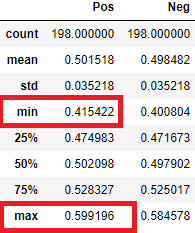

# Final Report 

by Andrew Ryan

## 1. Background 

The Northernlion Live Super Show is a long running video game live stream hosted on the website Twitch.tv. As streamers play games, a live chat feed scrolls alongside the video. Unlike comments on video sites like Youtube, which allow an ex post facto conversation, the live nature of Twitch means that comments are a way to interact with streamers in real time. In some cases, streamers may even have [conversations](https://clips.twitch.tv/StormyVainEelCurseLit) with the collective audience. This project looks at the sentiment of Twitch comments and tries to predict the overall sentiment of comments in a stream based on viewership and episode information.

## 2. Data Collection 

A corpus was compiled consisting of 5,000,000 comments from 200 episodes of the Northernlion Live Super Show. Corpus creation started with manually compiling a list of unique [video identifiers](Pipeline/VOD_ID_full.txt) found at the end of each video's URL. These video ids were fed into [rechat-dl](https://github.com/KunaiFire/rechat-dl) which downloads a JSON file of comments for each video. Information regarding the date of the comment, the username, and the content of the message were compiled into a dataframe of comments. Another dataframe was created from information about the [docket](http://twoandahalfscums.blogspot.co.uk/p/nlss.html) (games played on a stream, the users playing the games), and [viewership statistics](https://sullygnome.com/channel/Northernlion). These two dataframes were put together for a full dataframe which contained entries for each of the episodes with columns for the docket, stream statistics, and comments.

## 3. Data Cleaning 

Throughout each step of creating the corpus data had to be cut. The original list of dockets contained entries for 588 shows, while the files containing stream statistics only contained information on 441 shows. Removing duplicate shows and unrelated streams left a list of 303 videos that could be looked at. However, after downloading JSON files of comments for each of the videos, it was discovered that Twitch did not retain chat record chat records before a certain date. Removing files that did not contain comments resulted in 200 videos that could be analyzed.

The docket and player information were turned into lists. Information about the crew of players were standardized by converting various nicknames into a uniform name. Several show dates had been entered wrong in the docket list. These episodes were checked against records such as Tweets that mentioned the episode in order to fix the dates.

## 4. VADER Sentiment Analysis 

Sentiment Analysis was performed with [VADER](https://github.com/cjhutto/vaderSentiment). VADER was chosen as it is "specifically attuned to sentiments expressed in social media." VADER is a lexically based sentiment analyzer. A dictionary of words and their sentiment scores are created by having human raters from Amazon Mechanical Turk judge each word. When VADER analyzes a sentence, it first analyzes individual words (and emoticons) and assigns them a sentiment score between -4 (more negative) and 4 (more positive). The sentiment of a sentence is the sum of the scores of each word in the sentence normalized between -1 (more negative) and 1 (more positive).

In addition to the base word scores, VADER's sentiment scores factor in features such as capitalization, punctuation, negation, and degree modifiers. These scores, like the lexical scores, are based on human ratings from MTurk. These features then modify the overall score of a sentence. 

Example sentences which have been analyzed from comment data:

*Emoticons*
>":) :) :) :)"
>compound: 0.9001
>neg: 0.0 
>neu: 0.0 
>pos: 1.0

*Capitalization*
>"I DEMAND TOWERS"
compound: -0.128 
>neg: 0.6
>neu: 0.4
>pos: 0.0

However VADER unsurprisingly does not handle sarcasm
>"it's really exciting watching them shoot the same demon frogs over and over again for an hour"
>compound: 0.2716 
>neg: 0.115
>neu: 0.718 
>pos: 0.167

Each comment recieves four scores: compound, negative, neutral, and positive. The negative, neutral, and positive scores represent the percentage of words in the sentence which are labeled as such. The compound score is the sum of the scores with the feature rules applied and normalized between -1 and 1. For this analysis, the compound score was what was considered when determining the sentiment of a comment.

## 5. Sentiment Analysis Issues

Of the 5,000,000 comments analyzed by VADER, only 26% or 1,300,000 comments were able to be categorized as positive or negative.

 

The rest of the 74% of comments had a compound score of 0. This is not because the majority of comments in the corpus are neutral, but instead is an issue with how a lexically based sentiment analyzer deals with unknown words. As previously stated, the compound score is an aggregate of individual word scores, which are human rated scores stored in a dictionary. When a word is being analyzed and is not found in the dictionary of known words, it receives a score of 0. The sentence's compound score can than be calculated from its non-zero scores. However, if a sentence contains only unknown words, than the entire sentence will receive a compound score of zero. Along with unusual misspellings of words and gibberish, comments which occur frequently such as Twitch emotes like "!kappa" which are rendered on Twitch as images, or commands like "!docket" which cause a bot to respond with some action cause many comments to receive a zero score. It is also quite common for Twitch comments to be very short, often containing only one or two words. While VADER will try to use other words in a sentence to generate a compound score, if it only receives a handful of unknown words it will be unable to rate the sentence.

It was briefly considered that frequently missed words like emotes could be manually added into VADER's lexicon. However, because VADER's lexicon contains words paired with scores determined by many human judges, it seemed inappropriate to guess at valance scores even if an overall sentiment could be assumed.

A machine learning approach to sentiment analysis could possibly increase the number of usable comments by avoiding a dictionary approach. However, it would require a large number of words to be tagged for sentiment. This is a lengthy process and would require multiple human taggers to ensure words are tagged properly.

## 6. Score Prediction 

The goal of the machine learning section is to be able to predict the percentage of positive and negative comments a given video will have based on the stream statistics, docket list, and player list.

An overall sentiment score was determined for each episode by calculating the fraction of positive scores over the total number of comments in the episode. It was determined that videos ranged from 40% positive as a low and 60% positive as a high. 

The training features available include both categorical and numerical data. The categorical data includes information about the docket and crew and the numerical data includes information about the stream statistics.

Below are scatter plots of the relation between individual stream statistics (X-axis) and overall comment sentiment(Y-axis)

Average viewers in show

Followers gained in show

Followers per hour gained in show

Max viewers in show

Total views gained per show

Views per hour gained in show

Length of show in minutes

